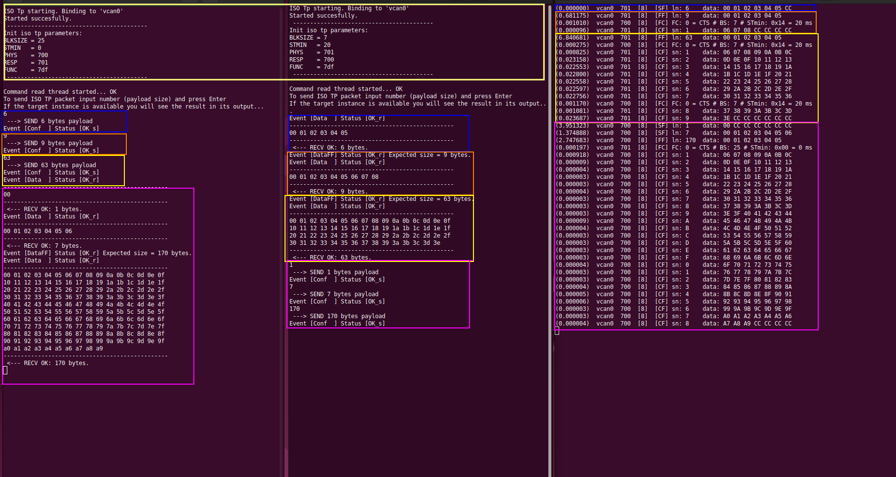

# UDS TO GO
## Lightwieght and simple to use UDS/DoCAN stack for MCU and other platforms

## Fast start and test
Repo has a test application based on socketCAN system which can be build and run to test and play with ISO-TP
To build and run test app (src/example/main.cpp) you have to have:
- Ubuntu PC (I didn't test it on any other Linux distributives)
- **can-utils** installed on you PC (optional, just to use **isotpdump**)
- **cmake** and C++ development toolkit (c++11 standard mandatory)

### Step 1
Install can-utils and build tools if necessary
### Step 2
Open terminal and go to the source code directory. Make directory for repo
``` 
mkdir uds-to-go
```
### Step 2
Clone repository from github
```
git clone https://github.com/astand/uds-to-go.git uds-to-go
```
### Step 3
Go to the repo directory and run build. There are also predefined shell scripts to run 
two instances of ISO-TP with test parameters. To use them they have to be executable
```
cd uds-to-go
cmake -S src -B build
cmake --build build
chmod u+x start-client.sh && chmod u+x start-serv.sh
```
### Step 4
ISO test app requiers alive socketCAN interface. Test scripts use interface 'vcan0', to start it up run the next commnad:
```
sudo ip link add name vcan0 type vcan
sudo ip link set dev vcan0 up
```
> To get vcan0 down use command:
> _sudo ip link delete vcan0_

### Step 5
Open three terminals and run next commands in each of them:
```
./start-client.sh
```
```
./start-serv.sh
```
```
isotpdump vcan0 -s 0x700 -d 0x701 -t d
```
After that you can send ISO-TP payloads with different length from server to client ang vice versa. 
You can also inspect CAN log in the ***isotpdump*** terminal

_Example of using server-client communication with isotpdump logging_



# Basic code explanation

The driver was made as light as possible (in a resonable extent). It completely ready to be used on MCU and
any kind of other embedded devices

The main features:
- No dynamic memory allocation
- No exception throwing
- Possibility to have more than one UDS instances in the same time


To integrate UDS driver to your project you have to provide adapters from low-level side 
and make base class implementation from the APP side

## Low level adaptation
### Timers
Both layers (network and session) use timers. To process timer you have to call static method of TickerCounter class periodically with frequency 1 Hz. In the example project it has been made by wrapping this call to class ***TickerWrapper*** (_src/example/ticker-wrapper.h_) which method _Process_ is called from main thread. It Processes core tick counter each 1 ms. For MCU implementation you can put this call _Timers::TickerCounter::ProcessTick()_ inside timer IRQ hanlder Attention: timers will work properly only if the size of core timer counter type (32-bit by default) is the same as the system base bit-width
As long as your system bit width is the same as the core timer counter type (32bit by default) everything is ok, timer is safe to be used in multithread environment, because ticker increment is going to be atomic. In other cases it is unsafe to use it with default implementation
### CAN Sender
You have to implement **_ICAN_Sender_** interface. Its main task is to send CAN frames to diagnostic CAN bus.
There is no difference if you use block approach (direct access to CAN HW and waiting transmittion compeletence) or async approach (with intermediate buffering). You have to return meaningful result.
> In example I use socketCAN wrapper ***CanSender*** (src/example/can-bridge.h)

Object which implements this interface must be binded to DoCAN_TP object by passing it as the first argument of DoCAN_TP constructor
### CAN Listener
You have to process **_ICAN_Listenere_** interface of DoCAN_TP object. In exmaple I made ***CanListener*** class (_src/example/can-bridge.h_) which passes all CAN frames from SocetCAN to DoCAN_TP instance which is binded to CanListener by passing a reference to constructor 

### Processing
Some classes implement interface IProcessable. This is quite useful for making processing more simple in the main thread. DoCAN_TP and SessionControl classes implement this interface. The TimerWrapper also implements this interface. 
There is also class **_ProcRunner_** which is able to collect a few IProcessable instances and run them all in main thread
```c
ProcRunner<4> procrunner;

procrunner.Add(&ticker);
procrunner.Add(&iso_tp);
procrunner.Add(&listener);

while (true)
{
  procrunner.RunAllProcess();
  ...
  sleep(1ms);
}
```
This processing aproach is optional. You can use any other way to make periodic processing all these instances.

From this point you are ready to send and receive ISO TP packets, as it is main in udstogo-test app.
Don't forget to set DoCAN_TP parameters (addresses, timeouts etc).

